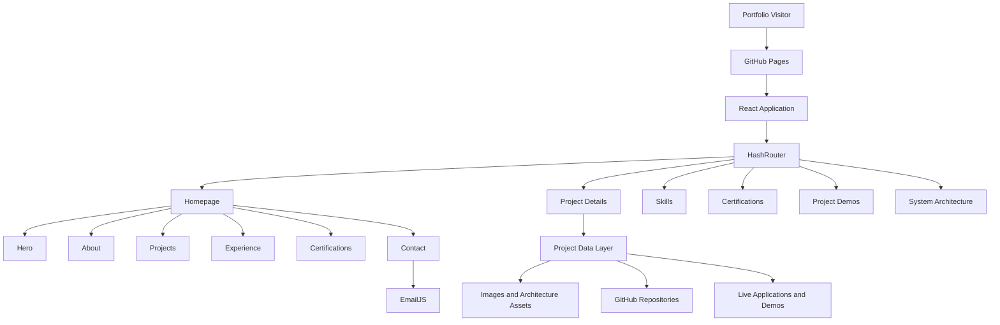

<div align="center">

# Youssef Bouzit — AI & Data Science Portfolio

### State Engineer in Data Science

**AI • Computer Vision • Machine Learning • RAG • MLOps**

Building practical AI systems for real-world problems.

<br />

[](https://youssef-bt.github.io/)
[](https://www.linkedin.com/in/youssef-bouzit-74863239b/)
[](https://github.com/YOUSSEF-BT)
[](mailto:bt.youssef.369@gmail.com)

<br />


</div>

---

## About the Portfolio

This repository contains the source code of my professional portfolio:

### **[youssef-bt.github.io](https://youssef-bt.github.io/)**

I am a **State Engineer in Data Science** with a focus on Artificial Intelligence, Computer Vision, Machine Learning, Controlled RAG and MLOps.

I completed a six-month **AI and Computer Vision engineering internship at NEXTRONIC, part of ABA Technology Group**, where I designed and developed a real-time road-accident detection system using deep learning, multi-object tracking and behavioral analysis.

My graduation project was defended with an **Excellent distinction and a score of 18/20**.

I am currently open to full-time opportunities in:

- AI Engineering
- Computer Vision Engineering
- Machine Learning Engineering
- Data Science
- RAG and LLM applications
- MLOps

---

## Purpose

This platform is designed to communicate engineering work clearly to recruiters, technical teams and potential collaborators.

It goes beyond project titles and screenshots by presenting:

- the problem addressed by each project;
- the proposed technical solution;
- the system architecture;
- the technologies and data used;
- the implementation decisions;
- the measured results;
- the evaluation context;
- the known limitations;
- the source repository;
- the available demonstration.

> **Not just a project gallery — a portfolio built around engineering evidence.**

---

## Engineering Focus

<table>
<tr>
<td width="25%" align="center">

### Computer Vision

Object detection, tracking, video intelligence and real-time analysis.

</td>
<td width="25%" align="center">

### Machine Learning

Prediction, classification, anomaly detection and evaluation.

</td>
<td width="25%" align="center">

### Controlled RAG

Retrieval, evidence filtering, citation validation and abstention.

</td>
<td width="25%" align="center">

### MLOps

Experiment tracking, orchestration, monitoring and delivery workflows.

</td>
</tr>
</table>

---

## Featured Engineering Work

The portfolio presents detailed case studies across:

```text
Artificial Intelligence
Computer Vision
Machine Learning
Deep Learning
Controlled RAG
MLOps
Data Engineering
NLP
Recommendation Systems
Intelligent Applications
```

Each project remains accessible through its dedicated page, with its architecture, results, limitations, source code and available demonstrations.

<div align="center">

[](https://youssef-bt.github.io/#/demos)
[](https://youssef-bt.github.io/#/skills)
[](https://youssef-bt.github.io/#/certifications)

</div>

---

## Platform Experience

### Engineering Content

- Dedicated project case-study pages
- System architecture visualizations
- Dataset and knowledge-base descriptions
- Evaluation metrics with contextual notes
- Technical challenges and implemented solutions
- Transparent limitations and future improvements
- Live demonstrations and source repositories

### User Experience

- Responsive desktop, tablet and mobile layouts
- French and English interfaces
- Dark and light themes
- Smooth client-side navigation
- Interactive visual background
- Modern glass-inspired interface
- Downloadable CV
- Professional contact form

---

## Technology Stack

<div align="center">

### Core Application


### Interface and Visualization


### Integration and Delivery


</div>

---

## Application Architecture



---

<details>
<summary><strong>Repository Structure</strong></summary>

<br />

```text
YOUSSEF-BT.github.io/
├── public/
│   └── assets/
│       ├── architecture/
│       ├── documents/
│       └── images/
│
├── src/
│   ├── components/
│   ├── context/
│   ├── data/
│   │   └── projects/
│   ├── layout/
│   ├── pages/
│   ├── sections/
│   ├── utils/
│   ├── App.jsx
│   ├── index.css
│   └── main.jsx
│
├── index.html
├── package.json
├── vite.config.js
└── README.md
```

</details>

---

<details>
<summary><strong>Local Development</strong></summary>

<br />

### Requirements

- Node.js 18 or later
- npm 9 or later
- Git

### Clone the Repository

```bash
git clone https://github.com/YOUSSEF-BT/YOUSSEF-BT.github.io.git
cd YOUSSEF-BT.github.io
```

### Install Dependencies

```bash
npm install
```

### Start the Development Server

```bash
npm run dev
```

The application will normally be available at:

```text
http://localhost:5173
```

### Create a Production Build

```bash
npm run build
```

### Preview the Production Build

```bash
npm run preview
```

### Run Code-Quality Checks

```bash
npm run lint
```

</details>

---

<details>
<summary><strong>Environment Configuration</strong></summary>

<br />

Create a `.env.local` file in the project root:

```env
VITE_EMAILJS_SERVICE_ID=your_service_id
VITE_EMAILJS_TEMPLATE_ID=your_template_id
VITE_EMAILJS_PUBLIC_KEY=your_public_key
```

Never commit private credentials or environment files.

</details>

---

<details>
<summary><strong>Deployment</strong></summary>

<br />

The portfolio is deployed through GitHub Pages.

```bash
npm run deploy
```

Production URL:

```text
https://youssef-bt.github.io/
```

</details>

---

## Engineering Principles

### Evidence Before Promotion

Important technical claims should be connected to visible project evidence.

### Evaluation Transparency

Metrics should always be presented with their scope and evaluation context.

### Documented Limitations

Known limitations should remain visible rather than being hidden behind promotional language.

### Complete System Ownership

Projects should demonstrate the full lifecycle from data and models to interfaces, validation and delivery.

### Professional Communication

Technical systems should remain understandable to both engineers and non-technical decision-makers.

---

## Current Status

```yaml
education:
  degree: State Engineering Degree in Data Science
  institution: SUP'MTI Rabat
  status: Completed

graduation_project:
  organization: NEXTRONIC — ABA Technology Group
  duration: February 2026 to August 2026
  status: Completed
  distinction: Excellent
  score: 18/20

professional_status:
  availability: Open to full-time opportunities
  location: Rabat, Morocco
  target_roles:
    - AI Engineer
    - Computer Vision Engineer
    - Machine Learning Engineer
    - Data Scientist
    - RAG / LLM Engineer
    - MLOps Engineer
```

---

## Contact

<div align="center">

### Open to full-time opportunities and technical collaborations.

<br />

[](https://youssef-bt.github.io/)
[](https://www.linkedin.com/in/youssef-bouzit-74863239b/)
[](https://github.com/YOUSSEF-BT)
[](mailto:bt.youssef.369@gmail.com)

</div>

---

## License

This project is distributed under the MIT License.

The source code may be studied, reused and adapted while preserving the original copyright and license notice.
